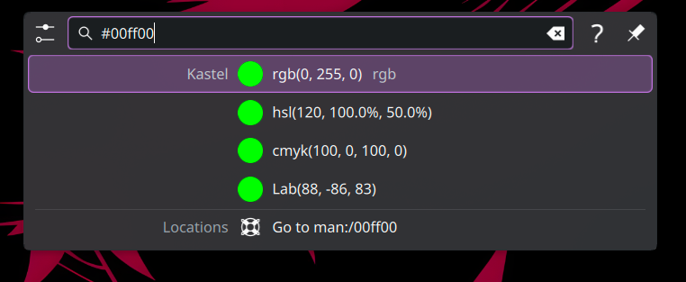
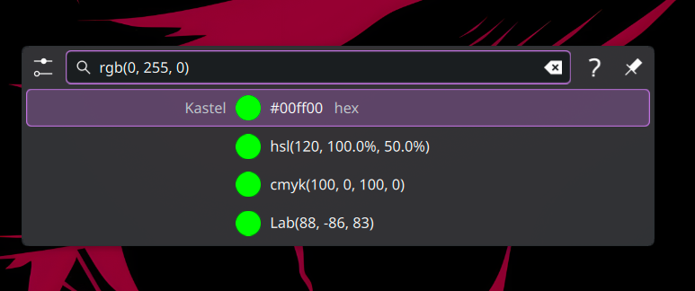

# kastel
 KDE Plasma 6 KRunner pastel plugin




# Build & Install
```
git clone https://github.com/Mykhail024/kastel.git && cd kastel
mkdir build && cd build
cmake .. && make
sudo make install && kquitapp6 krunner
```
